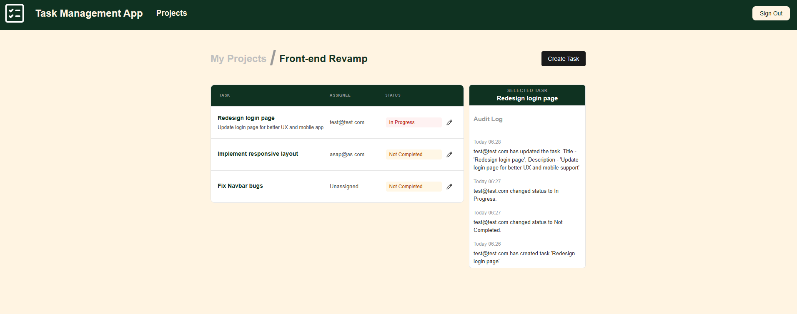

# 📋 Task Management App

A full-stack task management application with a .NET 10 backend API and React + Vite frontend. Features JWT authentication, event-driven architecture for audit logging, and comprehensive test coverage.



## 🎯 Overview

This project demonstrates modern software development practices:
- **Backend**: .NET 10 ASP.NET Core with service-oriented architecture
- **Frontend**: React + Vite for fast, responsive UI
- **Architecture**: Event-driven system with automatic audit trail creation
- **Testing**: 25+ comprehensive unit tests using xUnit and Moq
- **Security**: JWT authentication with BCrypt password hashing

Perfect for learning about event-driven architecture, dependency injection, and full-stack development with .NET and React.

## ⚙️ Installation

### Backend Setup

.NET 10 SDK

```bash
cd back-end\TaskManagementApp
dotnet restore
dotnet user-secrets init
dotnet user-secrets set "JwtSettings:Key" "YOUR_GENERATED_KEY_HERE"
dotnet tool install --global dotnet-ef
dotnet ef database update
dotnet run
```

Backend runs on: `https://localhost:7114/api`

### Frontend Setup

Node.js (v18+ recommended)

```bash
cd front-end/task-management-ui
npm install
cp .env.example .env
```

Then open `.env` and fill in your values:
- VITE_API_URL=[INSERT_API_URL] (if using default, then insert `https://localhost:7114/api`)

```bash
npm run dev
```

Frontend runs on: `http://localhost:5173`

## 🚀 Usage

### Backend - Example API Calls

**Login:**
```bash
curl -X POST https://localhost:7114/api/auth/login \
  -H "Content-Type: application/json" \
  -d '{"email":"user@example.com","password":"password123"}'
```

**Create Task:**
```bash
curl -X POST https://localhost:7114/api/tasks \
  -H "Authorization: Bearer <JWT_TOKEN>" \
  -H "Content-Type: application/json" \
  -d '{
    "title": "My Task",
    "description": "Task description",
    "projectId": "...",
    "userId": "..."
  }'
```

**View Task Audit Log:**
```bash
curl -X GET https://localhost:7114/api/tasklogs/{taskId} \
  -H "Authorization: Bearer <JWT_TOKEN>"
```

### Run Tests

```bash
dotnet test TaskManagementApp.Tests
```

## ✨ Features

- ✅ **User Management** - Registration, authentication
- ✅ **Frontend** - Fully functional React + Vite UI with protected routes, toast notifications, and responsive layouts
- ✅ **Projects** - Create, organize, and manage projects
- ✅ **Tasks** - Full CRUD with status tracking and assignment
- ✅ **Audit Logging** - Automatic task log creation via events
- ✅ **JWT Authentication** - Secure token-based auth with BCrypt
- ✅ **Event-Driven** - Decoupled services through event publishing
- ✅ **Comprehensive Tests** - 25+ unit tests

## 🛠️ Tech Stack

**Backend:**
- .NET 10 / C# 14.0
- ASP.NET Core
- Entity Framework Core
- SQLite
- xUnit, Moq (testing)

**Frontend:**
- React 19
- Vite
- Chakra UI - Component library
- React Router - Client-side routing
- React Query - Data fetching & caching
- Axios - HTTP client
- React Hot Toast - Notifications
- Framer Motion - Animations

## 📡 API Endpoints

| Method | Endpoint | Description | Auth Required |
|--------|----------|-------------|----------------|
| **Authentication** |
| POST | `/auth/login` | Login user | No |
| **Users** |
| POST | `/users` | Create new user | No |
| GET | `/users` | Get all users | Yes |
| GET | `/users/{id}` | Get user by ID | Yes |
| PUT | `/users/{id}` | Update user | Yes |
| DELETE | `/users/{id}` | Delete user | Yes |
| **Projects** |
| POST | `/projects` | Create new project | Yes |
| GET | `/projects` | Get all projects | Yes |
| GET | `/projects/{id}` | Get project by ID | Yes |
| PUT | `/projects/{id}` | Update project | Yes |
| DELETE | `/projects/{id}` | Delete project | Yes |
| **Tasks** |
| POST | `/tasks` | Create new task | Yes |
| GET | `/tasks` | Get all tasks | Yes |
| GET | `/tasks/{id}` | Get task by ID | Yes |
| PUT | `/tasks/{id}` | Update task | Yes |
| DELETE | `/tasks/{id}` | Delete task | Yes |
| **Task Logs (Audit Trail)** |
| GET | `/tasklogs/{taskId}` | Get audit logs for a task | Yes |

### Authentication Header

For protected endpoints (Auth Required = Yes), include:
```
Authorization: Bearer <JWT_TOKEN>
```

## 📁 Project Structure

```
Task-Management-App/
├── back-end/
│   ├── TaskManagementApp/          # Main API project
│   │   ├── Controllers/
│   │   ├── Services/
│   │   ├── Models/
│   │   ├── Events/
│   │   └── Program.cs
│   └── TaskManagementApp.Tests/    # Test project (25+ tests)
│
└── front-end/
    └── task-management-ui/         # React + Vite app
        ├── src/api/
        ├── src/assets/
        ├── src/components/
        ├── src/pages/
        ├── src/utils/
        ├── App.jsx
        ├── main.jsx
        └── vite.config.js
```

## 🤝 Contributing

1. Create a feature branch: `git checkout -b feature/your-feature`
2. Add tests for new features
3. Ensure all tests pass: `dotnet test`
4. Commit and push your changes
5. Create a pull request

## 📝 License

MIT License  
See `LICENSE` file for details.